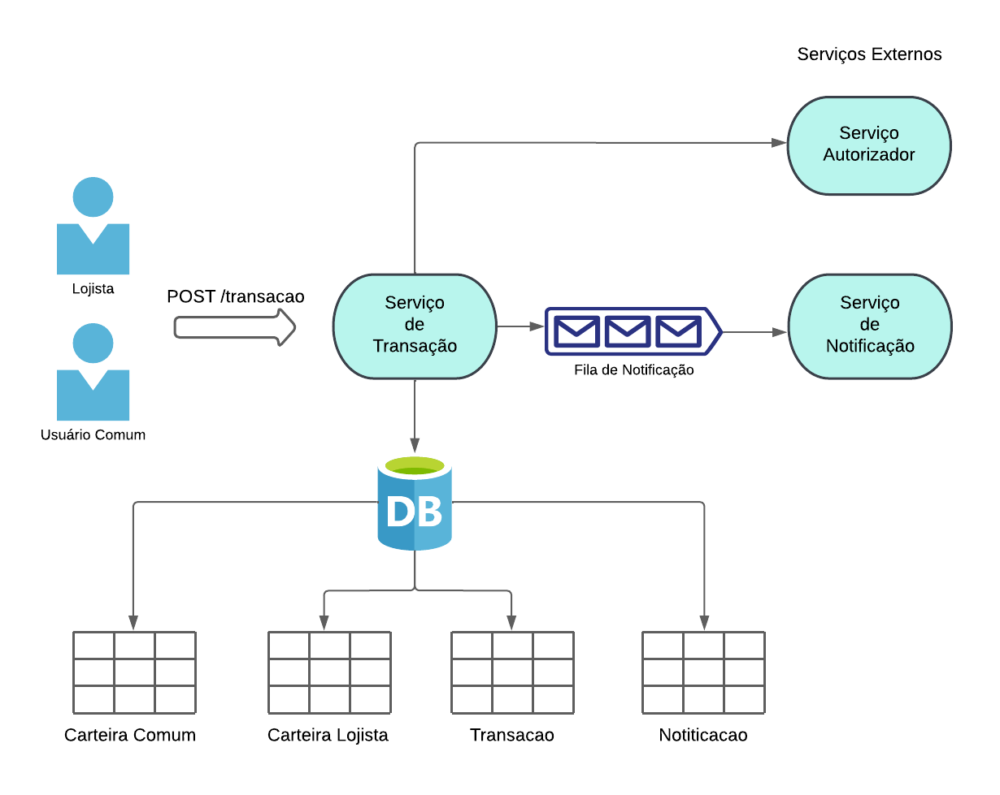
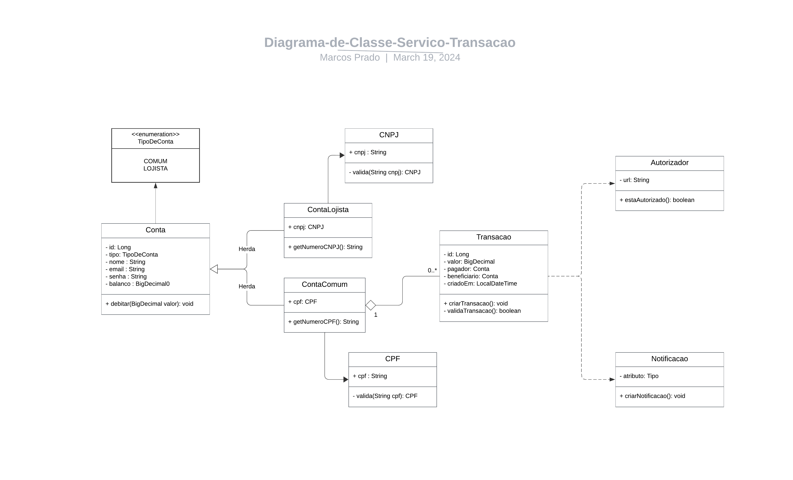

# Serviço de Pagamento

---

### Tecnologias Utilizadas:

- Java 21
- Spring Boot 3.2.3
- Banco de Dados H2
- Spring Data JPA
- Kafka

---

### Arquitetura do Serviço:

---

### Diagrama de Classes:

